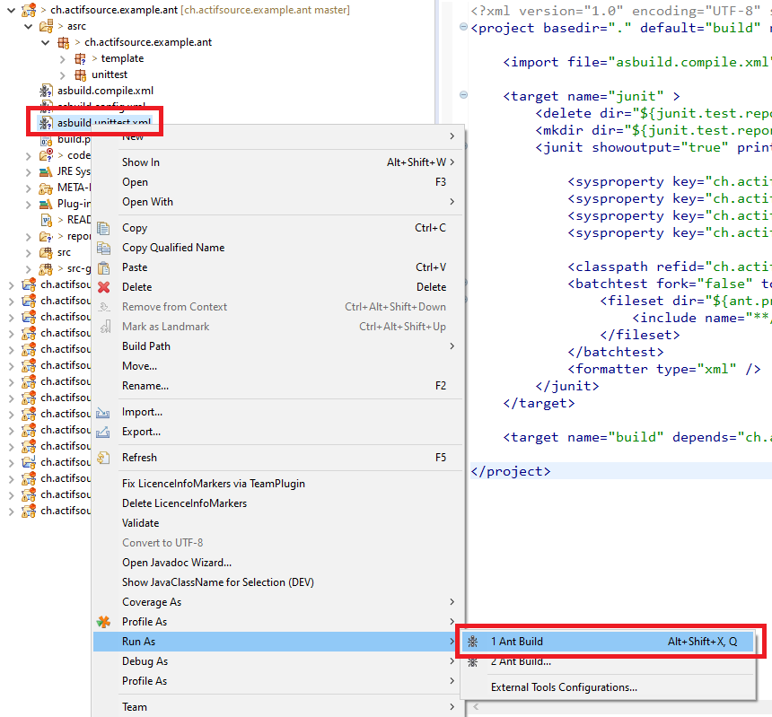

# Ant Build
In this project we will show how to set up the ant build.

## asbuild.config.xml

Define the ant config inside the asbild.config.xml:

```xml
<property name="actifsource.version" value="10.10.0.202005121415" />
<property name="bundle.directory" value="D:\Eclipse\eclipse-rcp-oxygen-3a-win32-x86_64\eclipse\plugins" />
<property name="ant.workspace" value="${basedir}/.." />
<property name="ant.project" value="${ant.workspace}/ch.actifsource.example.ant" />
<property name="junit.test.report" value="${ant.project}/reports" />
```

## Run Ant


* The ant script 'asbuild.unittest.xml' is used to execute the junit test. 

## Requirements
Actifsource Workbench Enterprise Edition

## License
[http://www.actifsource.com/company/license](http://www.actifsource.com/company/license)
