# Ant Build
In this project we will show how to set up the ant build.

## asbuild.config.xml

Define the ant config inside the asbild.dynamc.loading.xy.xml:

```xml
  <!-- Define the workspace root folder. No projects from this folder are included inside the platform use 'ch.actifsource.antdetect.projectFiles'. -->
  <!-- Example: 'D:/WORKBENCH/New_configuration' -->
  <property name="ch.actifsource.platform.workspaceRootFolder" value="D:/Eclipse/WORKBENCH/WORKBENCH_GITHUB"/>
  <!-- Define the bundle directories and include all bundles recursive from this directories. -->
  <!-- Example: 'D:/eclipse/plugins;C:\Users\.m2\repo\p2\osgi\bundle' -->
  <property name="ch.actifsource.antdetect.bundleFolders" value="D:\Eclipse\eclipse-rcp-2022-12-R-win32-x86_64\eclipse\plugins"/>
  <!-- Define the bundle files. -->
  <!-- Example: 'D:/eclipse/plugins/bundle1.jar;D:/eclipse/plugins/bundle2.jar' -->
  <property name="ch.actifsource.antdetect.bundleFiles" value="" />
  <!-- Define the project directories and include all projects recursive from this directories. -->
  <!-- Example: 'D:/WORKBENCH/New_configuration1;D:/WORKBENCH/New_configuration2' -->
  <property name="ch.actifsource.antdetect.projectFolders" value="D:/Eclipse/WORKBENCH/WORKBENCH_GITHUB"/>
  <!-- Define the project files. -->
  <!-- Example: 'D:/WORKBENCH/New_configuration/projectA;D:/WORKBENCH/New_configuration/projectA' -->
  <property name="ch.actifsource.antdetect.projectFiles" value="" />
  <!-- Define the projects classes output folder. Relative to the project path. -->
  <!-- Example: 'bin' or 'target/classes' -->
  <property name="ch.actifsource.antdetect.projectClassesOutput" value="bin" />
```

## Run Ant
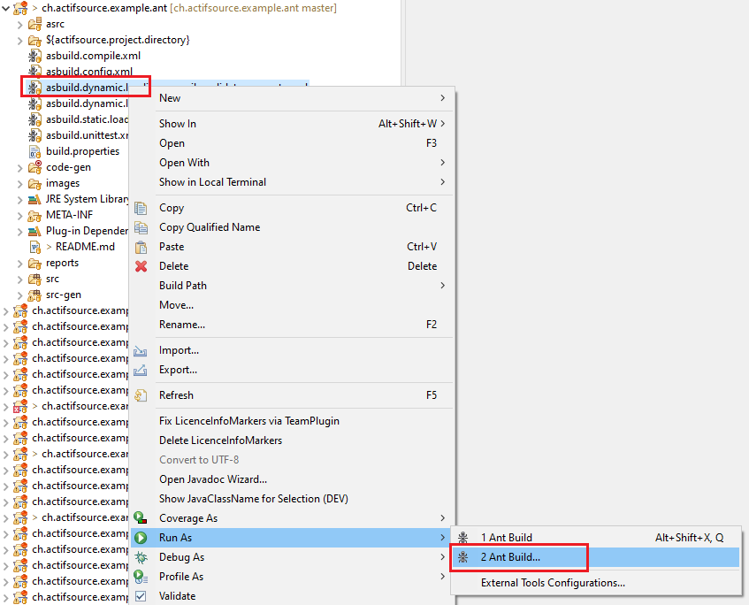

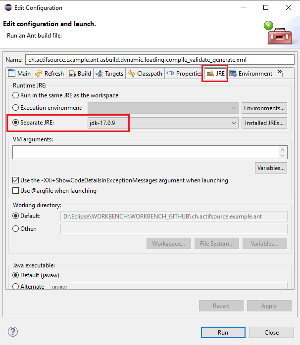

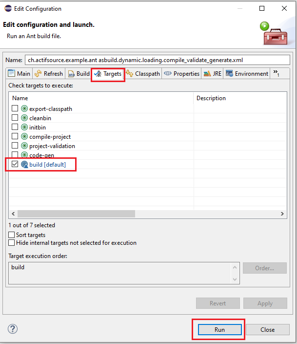

* The ant script 'asbuild.unittest.xml' is used to execute the junit test. 

## Export Ant to Generate Project

The corresponding Ant file can be generated automatically via Project Explorer 'Export->Actifsource->Ant BuildFiel Export':

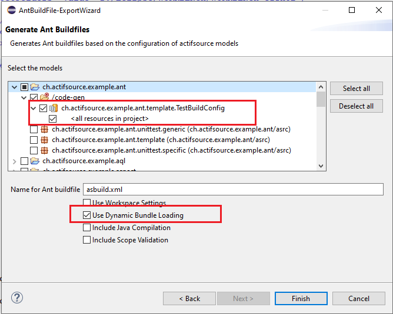


## Export Ant to Validate Project

The corresponding Ant file can be generated automatically via Project Explorer 'Export->Actifsource->Ant BuildFiel Export':

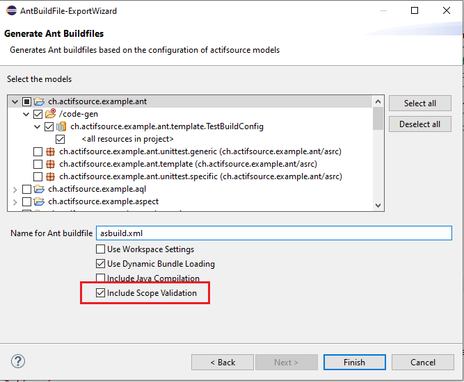

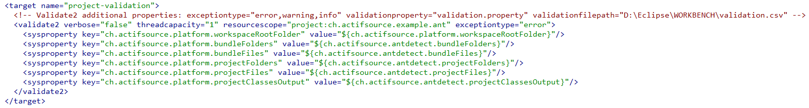

The validator can now be configured using the exceptiontype, validationproperty and validationfilepath properties.

- exceptiontype: Defines the error types that must occur for the target to produce an exception which stops the build.
- validationproperty: All errors that occur (error, warning or info) are written to this property, which can be used in the antscript.
- validationfilepath: All errors that occur (error, warning or info) are exported to this file. 
    
See 'asbuild.dynamic.loading.compile_validate_generate.xml'


## Export Ant to Compile Project

The corresponding Ant file can be generated automatically via Project Explorer 'Export->Actifsource->Ant BuildFiel Export':

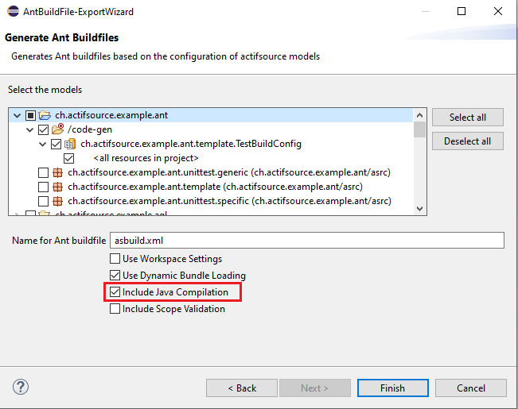

The Ant file now contains the following two essential targets:

1. export-classpath

This target can be used to collect the class path of a project, which is required to compile the project:

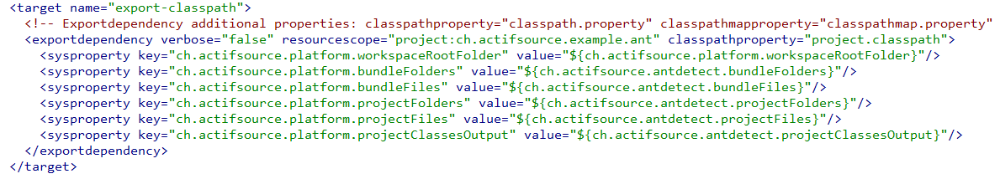

The export dependency can now be configured with the following properties:

- classpathproperty: The project classpath is written to the property and can be used in the antscript.  
- classpathseparator: The ClassPath separator (default ;) can be customized .
- classpathfile: The project classpath is written to the file.  

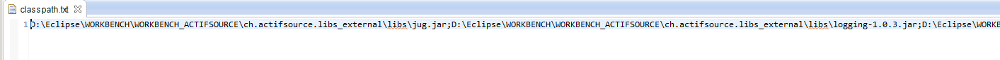


- classpathmapproperty: The Project ClasspathMap is written to the property and can be used in the antscript.    
- classpathmapfile: The Project ClasspathMap is written to the file.  

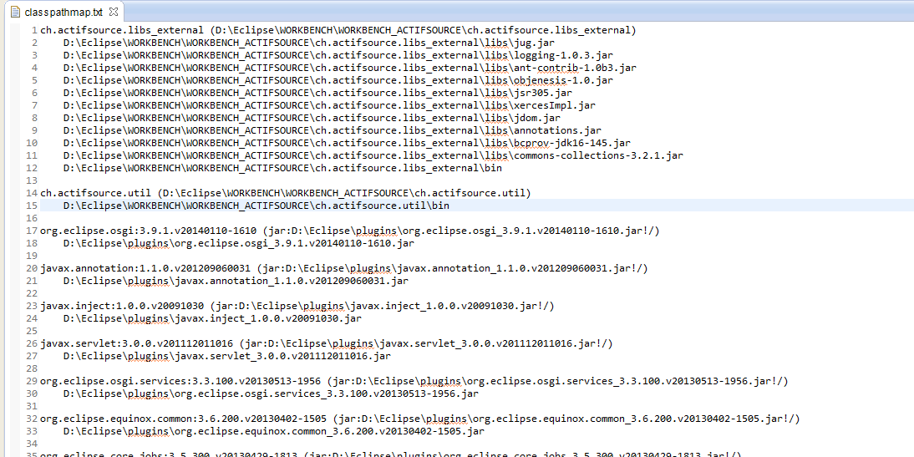

- dependencytreeproperty: The project dependencytree is written to the property and can be used in the antscript.    
- dependencytreefile: The project dependencytree is written to the file.

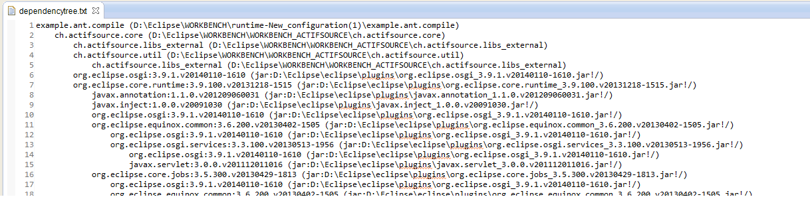


2. compile-project

The project can now be compiled using this target:

The 'classpathproperty' property from the 'export-classpath' target is used for the ClassPath.

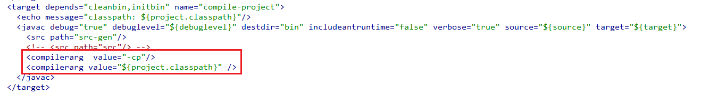


## Requirements
Actifsource Workbench Enterprise Edition

## License
[http://www.actifsource.com/company/license](http://www.actifsource.com/company/license)
