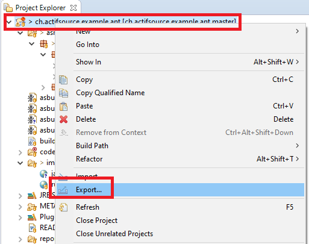
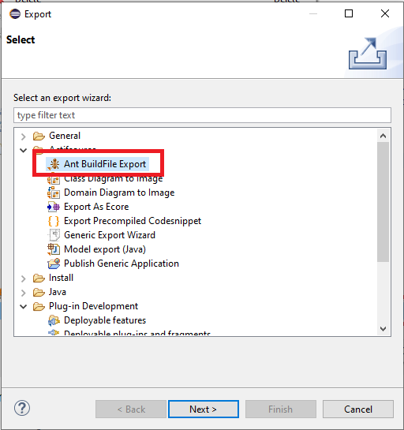
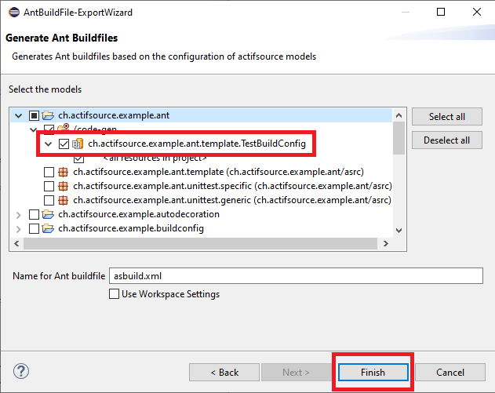

# Ant Build
In this project we will show how to set up the ant build.

## asbuild.config.xml

Define the ant config inside the asbild.config.xml:

```xml
<property name="actifsource.version" value="10.10.0.202005121415" />
<property name="bundle.directory" value="D:\Eclipse\eclipse-rcp-oxygen-3a-win32-x86_64\eclipse\plugins" />
<property name="ant.workspace" value="${basedir}/.." />
<property name="ant.project" value="${ant.workspace}/ch.actifsource.example.ant" />
<property name="junit.test.report" value="${ant.project}/reports" />
```

## Run Ant


* The ant script 'asbuild.unittest.xml' is used to execute the junit test. 

## Export Ant to Generate BuildConfig







## Export Ant to Validate Project

The corresponding Ant file can be generated automatically via Project Explorer 'Export->Actifsource->Ant BuildFiel Export':


The validator can now be configured using the exceptiontype, validationproperty and validationfilepath properties.

- exceptiontype: Defines the error types that must occur for the target to produce an exception which stops the build.
- validationproperty: All errors that occur (error, warning or info) are written to this property, which can be used in the antscript.
- validationfilepath: All errors that occur (error, warning or info) are exported to this file. 
    
See 'asbuild.dynamic.loading.compile_validate_generate.xml'


## Export Ant to Compile Project

The corresponding Ant file can be generated automatically via Project Explorer 'Export->Actifsource->Ant BuildFiel Export':


The Ant file now contains the following two essential targets:

1. export-classpath

This target can be used to collect the class path of a project, which is required to compile the project:


The export dependency can now be configured with the following properties:

- classpathproperty: The project classpath is written to the property and can be used in the antscript.  
- classpathseparator: The ClassPath separator (default ;) can be customized .
- classpathfile: The project classpath is written to the file.  


- classpathmapproperty: The Project ClasspathMap is written to the property and can be used in the antscript.    
- classpathmapfile: The Project ClasspathMap is written to the file.  


- dependencytreeproperty: The project dependencytree is written to the property and can be used in the antscript.    
- dependencytreefile: The project dependencytree is written to the file.


2. compile-project

The project can now be compiled using this target:

The 'classpathproperty' property from the 'export-classpath' target is used for the ClassPath.


## Requirements
Actifsource Workbench Enterprise Edition

## License
[http://www.actifsource.com/company/license](http://www.actifsource.com/company/license)
